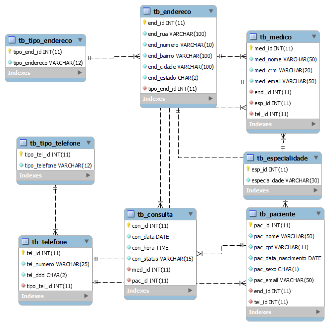

# 📊 Projeto para Estudos de Análise de Dados

## 📌 Sobre o Projeto

### Este projeto tem como objetivo criar um sistema hospitalar para cadastro de:

- 🏥 Pacientes
- 👨‍⚕️ Médicos
- 📅 Consultas
- 💊 Medicamentos

#### A iniciativa faz parte de um grupo de estudos voltado para a prática e aprendizado em análise de dados, utilizando tecnologias modernas para manipulação e visualização de informações.

## 🛠 Tecnologias Utilizadas

#### Para o desenvolvimento deste projeto, utilizaremos as seguintes tecnologias:

- 🐍 Python - Linguagem principal do projeto
- 🛢 MySQL - Banco de dados relacional
- 🌿 Git - Controle de versão
- 🔥 PySpark - Processamento distribuído de dados
- 📒 Jupyter Notebook - Ambiente interativo para códigos Python
- 🚀 Anaconda - Gerenciamento de pacotes e ambientes
- 🖥 Visual Studio Code - Editor de código
- 📦 Poetry - Gerenciamento de dependências Python
- 📂 Pyenv - Gerenciamento de versão do Python
- 📊 Streamlit - Criação de aplicações web interativas para dados

## 👥 Integrantes do Grupo de Estudos

- 🎓 Alessandro Oliveira
- 🎓 Mauro Lucios
- 🎓 Pedro Dutra
- 🎓 Pedro Fernandes
- 🎓 Leonardo Salvador
- 🎓 Josué

## 🗂 Diagrama DER (Diagrama Entidade Relacionamento)

## Vamos juntos aprender e crescer no mundo da análise de dados! 🚀📊

### "O sucesso é a soma de pequenos esforços repetidos dia após dia." 💪
